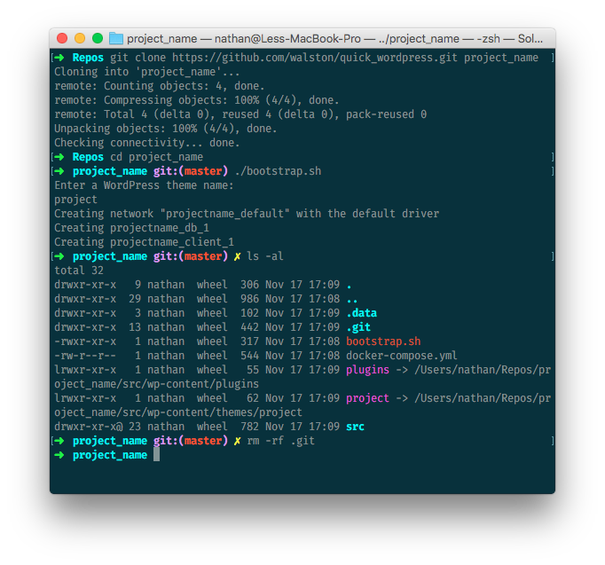

This is a simple script to launch docker-compose for a new WordPress project.

It's purpose is to provide a pre-boiler plate. i find myself copy-pasting this docker-compose and recreating these symlinks repeatedly, and would rather it be scripted.



clone this repo:

```
$ git clone https://github.com/walston/quick_wordpress.git project_name
```

Run `bootstrap.sh` from your new project directory

```
$ cd project_name
$ ./bootstrap.sh
```

you'll bee prompted for a WordPress theme name
and a corresponding symlink to the theme's direcory will be created, along with a symlink to the plugins directory.

Finally clear out *my* repo, and `init` your own:

- `src/` (for the entire wordpress directory)
- `theme/` (for just the the theme)
